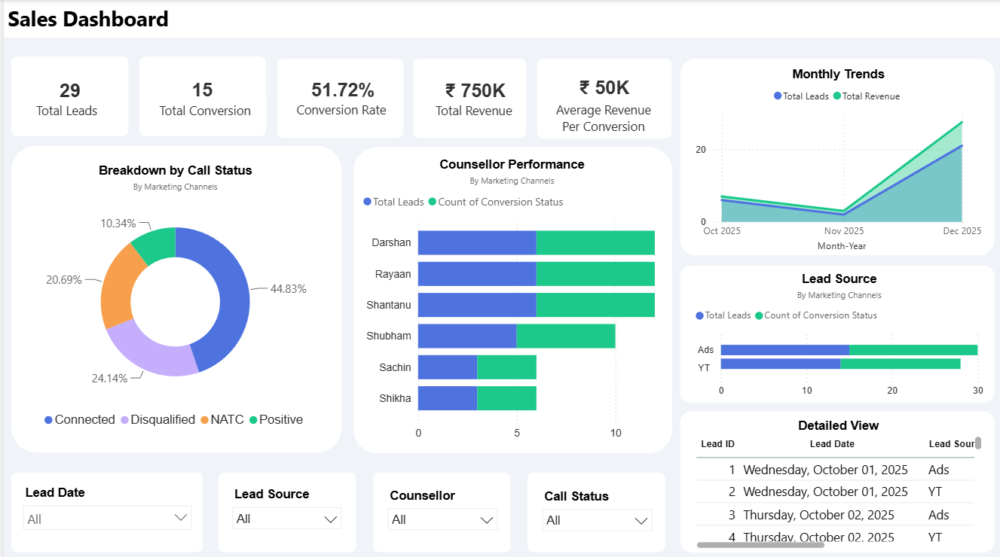

# 📊 Sales Performance Dashboard | Power BI

An interactive Power BI dashboard built to analyze sales/lead data, define meaningful KPIs, and surface actionable insights for sales and marketing decision-making.

---

## 🎯 Project Overview

The goal of this project was to take raw sales and lead data and transform it into a clear, business-friendly reporting tool. Rather than just displaying numbers, the focus was on **storytelling with data** — helping a sales manager understand performance and identify improvement areas within seconds of opening the report.

**Core objectives:**
- Clean and structure raw data for reliable reporting
- Identify and calculate relevant sales KPIs
- Design an intuitive, interactive dashboard
- Extract and communicate real business insights

---

## 🛠️ Tools & Skills Used

- **Power BI Desktop** — dashboard design and data modeling
- **Power Query** — data cleaning and transformation
- **DAX** — calculated KPIs and measures
- **Data Visualization & Storytelling**

---

## 📈 KPIs Defined

| KPI | Value | Why it matters |
|---|---|---|
| Total Leads | 29 | Top-of-funnel volume |
| Total Conversions | 15 | Bottom-of-funnel success |
| Conversion Rate | 51.72% | Overall funnel efficiency |
| Total Revenue | ₹750K | Business impact |
| Avg. Revenue per Conversion | ₹50K | Deal value benchmark |

---

## 🖼️ Dashboard Features

- **Breakdown by Call Status** — donut chart showing Connected, Disqualified, NATC, and Positive outcomes
- **Counsellor Performance** — bar chart comparing leads handled vs. conversions per counsellor
- **Monthly Trends** — area chart tracking leads and revenue over time
- **Lead Source Analysis** — comparison of channels (Ads vs. YT) by leads and conversions
- **Detailed View** — a filterable, drill-down table of individual leads
- **Interactive Slicers** — filter by Lead Date, Lead Source, Counsellor, and Call Status

---

## 💡 Key Insights

1. **Ads is the stronger-performing lead source** compared to YT, both in volume and conversions — suggesting marketing spend could be prioritized toward Ads.
2. **"Connected" calls represent the largest share of call outcomes**, making call-handling quality on connected leads a higher-leverage improvement area than simply generating more leads.
3. **Conversion rate sits at 51.72%**, meaning roughly 1 in 2 leads convert — a strong baseline, with room to improve via targeted follow-up on non-connected leads.

📄 Full write-up: [Insights Summary](docs/insights-summary.md)

---

## 🎥 Walkthrough Video

A short video walkthrough explaining the dashboard is available here: **[Add video link]**

---

## 📬 Contact

**[Rosalint Celcia]**
[www.linkedin.com/in/rosalint-celcia] | [rosalint.celciaa@gmail.com] | [Portfolio Website]

---

*This project was built independently to practice and demonstrate Power BI dashboard design, DAX, and data storytelling skills.*
